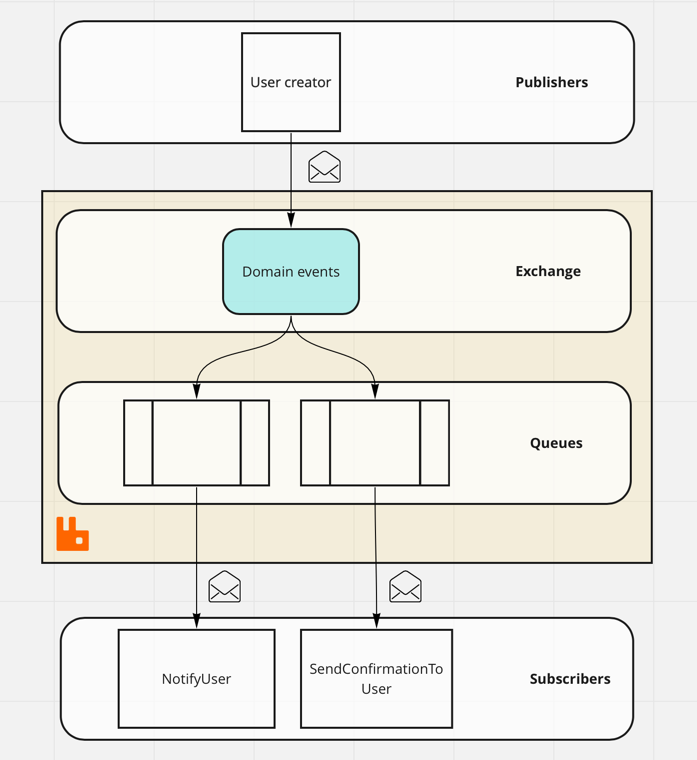
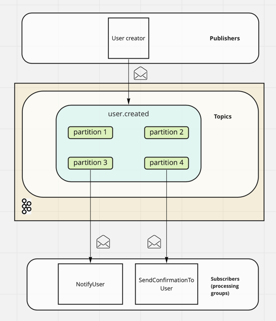

# Message brokers

Project consisting of several microservices communicating using an asynchronous event bus

## Architecture

                     +-------------------+
                     |                   |
                     |  Message-broker   |
                     |                   |
                     +------+-----+------+
                            ^     |
                +-----------+     +------------+
                |     Publish     Consume      |
                |                              |
                |                              v
      +---------+------------+       +---------+------------+
      |                      |       |                      |
      |     User-service     |       | Notification-service |
      |                      |       |                      |
      +----------------------+       +----------------------+

## Implementations

It can be run using different message brokers

### Rabbit MQ

### Kafka

## Set up

- Start docker
- run docker-compose up -d
- Start both projects:
    - Run UserApplication.kt
    - Run NotificationApplication.kt
- To run Rabbit as broker:
    - Open UserApplication.kt and create RabbitPublisher/KafkaPublisher
    - Open NotificationApplication.kt and use userRabbit()/useKafka()

## Test

- Post to localhost:8080/users , body: username
- Notifications service will send the notifications (print in console the user name)